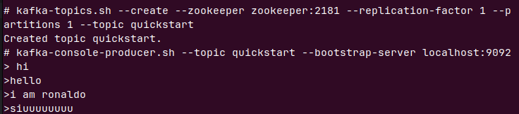

# SpringBoot with Kafka
**What is Kafka?**
1. Open-source event streaming platform

## Kafka Components and Architecture
### Components
1. **Producer** :- Producer is the source of data who publishes messages or events.
2. **Consumer** :- Is a receiver which takes messages or events from producer.
3. **Broker** :- Messages sent from the publisher go through a broker which is a Kafka server. Broker is just a intermediate entity
that helps in message exchange between a producer and consumer.
4. **Cluster** :- One or more Brokers are called Kafka Cluster.
5. **Topic** :- Topics are used to store categorize different type of messages. Listeners can then respond to the messages that belong 
to the topics they are listening on.
6. **Partitions** :- Kafka topics are broken into multiple parts and distribute the parts into different machines. This concept is called
topic partitioning. And each part is called partition in Kafka.
7. **Offset** :- A number is assigned to the message within a partition. This number is called Offset.
8. **Consumer Groups** :- Grouping consumers for dividing the workload of messages to achieve better throughput.
9. **Zookeeper** :- Zookeeper is coordination and to track the status of Kafka cluster nodes. It keeps track of Kafka topics, partitions, offset, etc.

## Producer - Consumer workflow Kafka CLI
### Run Kafka and Zookeeper
Run Kafka and Zoo Keeper using docker compose file [here](docker-compose.yml). Within the docker container go into the opt/kafka<verison>/bin folder. 
And execute the commands to create topic, produce or consume.

### Create Topic
```shell
kakfa-topics.sh --bootstrap-server localhost:9092 --create --topic quickstart --replication-factor 1 --partitions 1 
```
**NOTE** : Either add `--bootstrap-server` or `zookeeper` \
1. Replication Factor: Total number of replicas of topics.  

### List Topics
```shell
kafka-topics.sh --bootstrap-server localhost:9092 --list
```

### Describe Topics
```shell
kafka-topics.sh --bootstrap-server localhost:9092 --describe --topic quickstart
```

### Publishing Messages
```shell
kafka-console-producer.sh --broker-list localhost:9092 --topic quickstart
```


Sending CSV files through CLI
```shell
kafka-console-producer.sh --broker-list localhost:9092 --topic topi < path_to_csv_file/file.csv 
```

### Consuming Messages
```shell
kakfa-console-consumer.sh --topic quickstart --from-beginning --bootstrap-server localhost:9092
```


## Kafka in Spring Boot
### Producer
1. Adding dependencies
```xml
<dependency>
    <groupId>org.springframework.kafka</groupId>
    <artifactId>spring-kafka</artifactId>
    <version>3.2.0</version>
</dependency>
```
2. Creating Service and class
```java
@Service
@Slf4j
public class KafkaMessagePublisher {

    @Autowired
    private KafkaTemplate<String, Object> kafkaTemplate;

    public void sendMessageToTopic(String message) {
        CompletableFuture<SendResult<String, Object>> topic = kafkaTemplate.send(
                "topic-batman",
                message
        );
        topic.whenComplete((result, ex) -> {
            if (Objects.isNull(ex)) {
                log.info("Sent message = [{}] with offset = [{}]", message, result.getRecordMetadata().offset());
            } else {
                log.error("Unable to send message = [{}] due to : {}", message, ex.getMessage());
            }
        });
    }
}
```
3. Using the service we can publish events in the Kafka.
4. Creating a Topic.
```java
@Configuration
public class KafkaConfiguration {
    @Bean
    public NewTopic createTopic() {
        return new NewTopic("topic-batman", 3, (short) 1);
    }
}
```

### Consumer
1. Dependencies are similar to the producer.
2. Creating service layer in consumer
```java
@Service
@Slf4j
public class KafkaMessageListener {

    private final String topicName = "topic-batman";

    // Consumers are there as a demo!! Not a good way to create consumers like these
    @KafkaListener(topics = topicName, groupId = "jt-group-1")
    public void consumer1(String message) {
        log.info("Consumer 1 message: {}", message);
    }

    @KafkaListener(topics = topicName, groupId = "jt-group-1")
    public void consumer2(String message) {
        log.info("Consumer 2 message: {}", message);
    }

    @KafkaListener(topics = topicName, groupId = "jt-group-1")
    public void consumer3(String message) {
        log.info("Consumer 3 message: {}", message);
    }
}
```
**NOTE**: Creating groups in such manner is bad practice. Good practice is to use concurrency and then developing will give a better throughput.